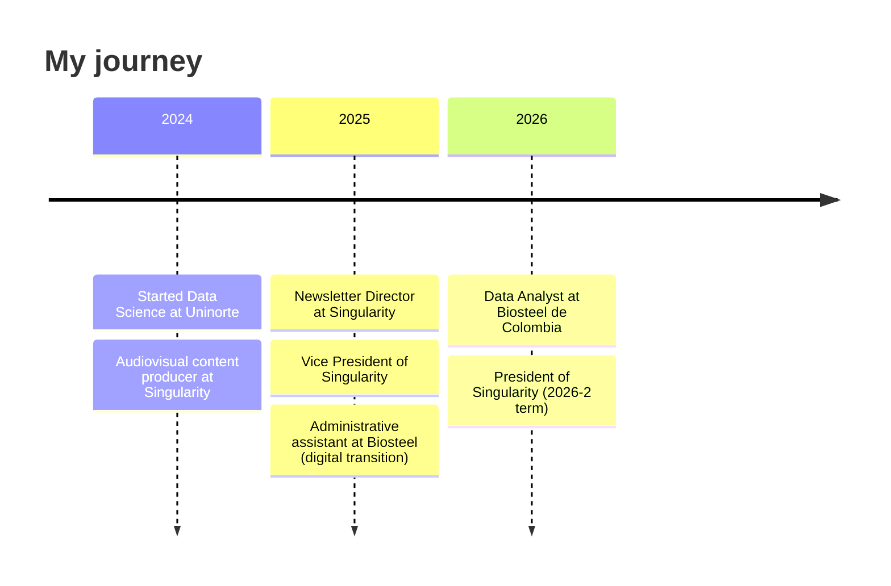

 

[🇪🇸 Español](README.md) · **🇬🇧 English**

---

## 👋 Hi, I'm Valeria

I turn scattered data into **Business Intelligence models** that enable fast, well-founded decisions. I'm a **Data Analyst at Biosteel de Colombia**, a **Data Science student at Universidad del Norte**, and **President of Singularity**, Uninorte's student group for Data Science and AI.

What sets me apart: **I don't just analyze data, I explain it.** I share the real process through vlogs and reels: moving from manual Excel reports to dynamic Power BI dashboards, structuring DAX measures without getting lost, and what daily life looks like as a student and a data professional at the same time.

> 💬 Want to automate your company's business intelligence or collaborate on tech content? **[Message me](https://www.linkedin.com/in/valeriaflorezs/)**.

---

## 🧰 Stack

  

-0F172A?style=for-the-badge)

<b>🎯 Strengths by area (click to expand)</b>

 

| Area | What I do | With |
| :-- | :-- | :-- |
| **BI & storytelling** | Data models, measures and automated dashboards | Power BI (certified), DAX, Power Query (M) |
| **Machine Learning** | End-to-end pipelines, rigorous validation, interpretability | Python, scikit-learn, SHAP, LIME |
| **MLOps** | From notebook to a deployable API with CI/CD and monitoring | FastAPI, Docker, Kubernetes, GitHub Actions, Evidently |
| **Statistics** | Statistical modeling and reproducible reports | R, R Markdown |
| **Algorithms** | Data structures and graph theory from scratch | Python, Java |
| **Mathematics** | Solid foundation for modeling | Linear Algebra (5.0), Calculus (4.8), Discrete Math (4.7) |

---

## 🚀 Featured projects

### 🔬 Machine Learning & MLOps

<table>
<tr>
<td width="50%" valign="top">

#### 💳 [Default of Credit Card Clients](https://github.com/valeriaflorezs/Credit_Card_Project)
A complete data science pipeline to predict payment default across **30,000 clients** (UCI).

- ETL + EDA handling class imbalance (~22 % default)
- **112 configurations**: 7 models × 4 balancing techniques × 4 optimization methods, with nested cross-validation
- Minority-class F1 improved from **~0.38 to 0.52–0.55** with balancing
- Interpretability with **SHAP and LIME**
- R version: [Credit_Card_R](https://github.com/valeriaflorezs/Credit_Card_R)

`Python` `scikit-learn` `XGBoost` `SHAP` `Colab GPU`

</td>
<td width="50%" valign="top">

#### ❤️ [Heart Disease MLOps](https://github.com/valeriaflorezs/heart-disease-mlops)
Heart failure prediction **end to end**: from notebook to production.

- Data leakage detection and safe-validation modeling
- Prediction API with **FastAPI**
- **Docker** containerization and **Kubernetes** manifests
- **CI/CD** with GitHub Actions
- Data drift monitoring with **Evidently**

`FastAPI` `Docker` `Kubernetes` `GitHub Actions` `Evidently`

</td>
</tr>
<tr>
<td width="50%" valign="top">

#### 🎬 [Swipe & Watch](https://github.com/valeriaflorezs/Swipe-Watch)
**Hybrid** movie recommendation system.

- **Bipartite graph** to model genre affinity
- **k-NN** (Euclidean distance) to classify and recommend

`Python` `Graphs` `k-NN`

</td>
<td width="50%" valign="top">

#### 🕸️ [Graph NetworkX Affinity Model](https://github.com/valeriaflorezs/Graph-NetworkX-Affinity-Model) · [Graph Theory Python](https://github.com/valeriaflorezs/Graph-Theory-Python)
Applied graph-theory modeling and analysis.

`Python` `NetworkX`

</td>
</tr>
</table>

### 📊 Data, BI & visualization

| Project | Description | Stack |
| :-- | :-- | :-- |
| [**Biosteel Learning Hub**](https://github.com/valeriaflorezs/BiosteelLearning_BI) | Interactive learning portal with resources, videos and training guides for Biosteel | `React` `Vite` `Tailwind` |
| [**Claude Guide · Biosteel**](https://github.com/valeriaflorezs/guia-claude-biosteel) | Guide to using Claude at work | `JavaScript` |
| [**Give Me Some Credit**](https://github.com/valeriaflorezs/GiveMeSomeCredit) · [(R)](https://github.com/valeriaflorezs/GiveMeSomeCredit_R) | Credit risk modeling, in Python/LaTeX and in R | `R` `Python` |
| [**R Statistical Modeling · Taiwan Real Estate**](https://github.com/valeriaflorezs/R-Statistical-Modeling-Taiwan-RealEstate) | Statistical modeling of real estate prices | `R` `R Markdown` |
| [**R Markdown · Statistical Projects**](https://github.com/valeriaflorezs/R-Markdown-Proyectos-Estadisticos) | Collection of reproducible statistical analyses | `R Markdown` |
| [**DataVisualLab**](https://github.com/valeriaflorezs/DataVisualLab) · [**rbook_dataviz**](https://github.com/valeriaflorezs/rbook_dataviz) · [**Entregas_Dataviz**](https://github.com/valeriaflorezs/Entregas_Dataviz) | Data visualization lab | `R` `HTML` |

### 🧠 Algorithms & data structures

| Project | Description |
| :-- | :-- |
| 🎮 [**Gems Seeker**](https://github.com/valeriaflorezs/Gems_seeker) | Educational video game with a **Binary Search Tree** built from scratch (successor, predecessor and 3-case deletion) to manage the player's inventory |
| ⚖️ [**Recursive vs. Iterative**](https://github.com/valeriaflorezs/Comparative-Analysis-Recursive-vs-Iterative) | Comparative analysis of both approaches |
| 🔐 [**ENCRIPT-A**](https://github.com/valeriaflorezs/ENCRIPT-A) | Encryption project in Java |
| 🏋️ [**Sports Center Management**](https://github.com/valeriaflorezs/Gestion-Centro-Deportivo-Java) · 🛒 [**Sales & Inventory Control**](https://github.com/valeriaflorezs/Control-Ventas-Inventario-Java) · 🔁 [**Recursive Menu**](https://github.com/valeriaflorezs/Menu-Recursivo-Java) | Object-oriented Java applications |

---

## 💼 Experience

<b>📈 Data Analyst · Biosteel de Colombia S.A.</b> — Feb 2026 – present

 

- Led the **migration of operational and commercial reports** from manual Excel processes to **dynamic BI models in Power BI**.
- Designed data models with **DAX and Power Query (M)** to consolidate scattered sources into single, automated reports.
- Built clean data transformations that **reduced report preparation time** for the sales team.
- Exploratory analysis and source validation with **Python and R** before loading data into the model.
- *Earlier (Dec 2025 – Jan 2026), as Administrative Assistant:* supported the centralization of information across Billing, Accounting, Warehouse and Purchasing, translating manual metrics into automated dashboards together with each area's leaders.

<b>🌌 President · Singularity — Data Science & AI Group (Uninorte)</b> — Jun 2026 – present

 

- Strategic leadership of the student Data Science & AI group (2026-2 term).
- Technical outreach events and **Python, R and Power BI workshops** for Barranquilla's tech student community.
- Content strategy: vlogs, reels and newsletters.
- Coordination with university leadership to expand the group's reach.
- *Path at Singularity:* Audiovisual content producer (2024) → Newsletter Director (2025) → Vice President (2025–2026) → President (2026).

<b>🤝 Volunteering & other experience</b>

 

- **Fundación Academia Neva Lallemand** · drawing classes for children aged 8 to 14 at Colegio Distrital Los Rosales (2024).
- **Selvana** · interactive experience guide among animatronic animal exhibits (Dec 2024).

---

## 🏅 Certifications

---

## 📈 GitHub in numbers

---

### 🤝 Let's build something with data

⭐ If a project helped you, leave it a star.

