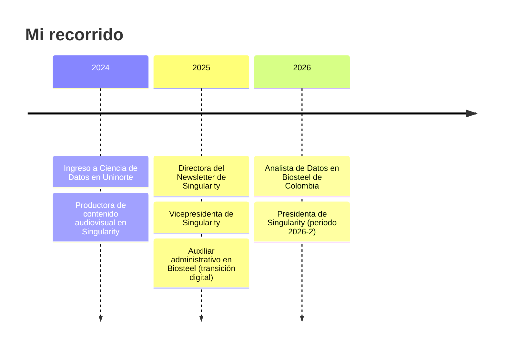

 

---

## 👋 Hola, soy Valeria

Convierto datos dispersos en **modelos de Business Intelligence** que permiten decidir rápido y con fundamento. Soy **Analista de Datos en Biosteel de Colombia**, **estudiante de Ciencia de Datos en la Universidad del Norte** y **Presidenta de Singularity**, el grupo estudiantil de Ciencia de Datos e IA de Uninorte.

Lo que me diferencia: **no solo analizo datos, los explico.** Comparto el proceso real en vlogs y reels: de reportes manuales en Excel a dashboards dinámicos en Power BI, cómo estructurar medidas DAX sin perderse, y cómo es el día a día siendo estudiante y profesional de datos a la vez.

> 💬 ¿Quieres automatizar la inteligencia de negocios de tu empresa o colaborar en contenido tech? **[Escríbeme](https://www.linkedin.com/in/valeriaflorezs/)**.

---

## 🧰 Stack

  

-0F172A?style=for-the-badge)

<b>🎯 Fortalezas por área (clic para expandir)</b>

 

| Área | Qué hago | Con qué |
| :-- | :-- | :-- |
| **BI y storytelling** | Modelos de datos, medidas y dashboards automáticos | Power BI (certificada), DAX, Power Query (M) |
| **Machine Learning** | Pipelines completos, validación rigurosa, interpretabilidad | Python, scikit-learn, SHAP, LIME |
| **MLOps** | Del notebook a una API desplegable con CI/CD y monitoreo | FastAPI, Docker, Kubernetes, GitHub Actions, Evidently |
| **Estadística** | Modelado estadístico y reportes reproducibles | R, R Markdown |
| **Algoritmia** | Estructuras de datos y teoría de grafos desde cero | Python, Java |
| **Matemáticas** | Base sólida para modelar | Álgebra Lineal (5.0), Cálculo (4.8), Mat. Discretas (4.7) |

---

## 🚀 Proyectos destacados

### 🔬 Machine Learning y MLOps

<table>
<tr>
<td width="50%" valign="top">

#### 💳 [Default of Credit Card Clients](https://github.com/valeriaflorezs/Credit_Card_Project)
Pipeline completo de ciencia de datos para predecir incumplimiento de pago en **30.000 clientes** (UCI).

- ETL + EDA con desbalance de clases (~22 % de *default*)
- **112 configuraciones**: 7 modelos × 4 técnicas de balanceo × 4 métodos de optimización, con validación cruzada anidada
- F1 de la clase minoritaria: de **~0.38 a 0.52–0.55** con balanceo
- Interpretabilidad con **SHAP y LIME**
- Versión en R: [Credit_Card_R](https://github.com/valeriaflorezs/Credit_Card_R)

`Python` `scikit-learn` `XGBoost` `SHAP` `Colab GPU`

</td>
<td width="50%" valign="top">

#### ❤️ [Heart Disease MLOps](https://github.com/valeriaflorezs/heart-disease-mlops)
Predicción de falla cardíaca **de extremo a extremo**: del notebook a producción.

- Detección de *data leakage* y modelado con validación segura
- API de predicción con **FastAPI**
- Contenerización con **Docker** y manifiestos de **Kubernetes**
- **CI/CD** con GitHub Actions
- Monitoreo de deriva de datos con **Evidently**

`FastAPI` `Docker` `Kubernetes` `GitHub Actions` `Evidently`

</td>
</tr>
<tr>
<td width="50%" valign="top">

#### 🎬 [Swipe & Watch](https://github.com/valeriaflorezs/Swipe-Watch)
Sistema de recomendación de películas **híbrido**.

- **Grafo bipartito** para modelar afinidad de género
- **k-NN** (distancia euclídea) para clasificar y recomendar

`Python` `Grafos` `k-NN`

</td>
<td width="50%" valign="top">

#### 🕸️ [Graph NetworkX Affinity Model](https://github.com/valeriaflorezs/Graph-NetworkX-Affinity-Model) · [Graph Theory Python](https://github.com/valeriaflorezs/Graph-Theory-Python)
Modelado y análisis con teoría de grafos aplicada.

`Python` `NetworkX`

</td>
</tr>
</table>

### 📊 Datos, BI y visualización

| Proyecto | Descripción | Stack |
| :-- | :-- | :-- |
| [**Biosteel Learning Hub**](https://github.com/valeriaflorezs/BiosteelLearning_BI) | Portal de aprendizaje interactivo con recursos, videos y guías de entrenamiento para Biosteel | `React` `Vite` `Tailwind` |
| [**Guía Claude · Biosteel**](https://github.com/valeriaflorezs/guia-claude-biosteel) | Guía para el uso de Claude en el trabajo | `JavaScript` |
| [**Give Me Some Credit**](https://github.com/valeriaflorezs/GiveMeSomeCredit) · [(R)](https://github.com/valeriaflorezs/GiveMeSomeCredit_R) | Modelado de riesgo crediticio, en Python/LaTeX y en R | `R` `Python` |
| [**R Statistical Modeling · Taiwan Real Estate**](https://github.com/valeriaflorezs/R-Statistical-Modeling-Taiwan-RealEstate) | Modelado estadístico de precios inmobiliarios | `R` `R Markdown` |
| [**R Markdown · Proyectos Estadísticos**](https://github.com/valeriaflorezs/R-Markdown-Proyectos-Estadisticos) | Colección de análisis estadísticos reproducibles | `R Markdown` |
| [**DataVisualLab**](https://github.com/valeriaflorezs/DataVisualLab) · [**rbook_dataviz**](https://github.com/valeriaflorezs/rbook_dataviz) · [**Entregas_Dataviz**](https://github.com/valeriaflorezs/Entregas_Dataviz) | Laboratorio de visualización de datos | `R` `HTML` |

### 🧠 Algoritmos y estructuras de datos

| Proyecto | Descripción |
| :-- | :-- |
| 🎮 [**Gems Seeker**](https://github.com/valeriaflorezs/Gems_seeker) | Videojuego educativo con un **Árbol Binario de Búsqueda** implementado desde cero (sucesor, predecesor y eliminación en 3 casos) para el inventario del jugador |
| ⚖️ [**Recursivo vs. Iterativo**](https://github.com/valeriaflorezs/Comparative-Analysis-Recursive-vs-Iterative) | Análisis comparativo de ambos enfoques |
| 🔐 [**ENCRIPT-A**](https://github.com/valeriaflorezs/ENCRIPT-A) | Proyecto de cifrado en Java |
| 🏋️ [**Gestión Centro Deportivo**](https://github.com/valeriaflorezs/Gestion-Centro-Deportivo-Java) · 🛒 [**Control Ventas e Inventario**](https://github.com/valeriaflorezs/Control-Ventas-Inventario-Java) · 🔁 [**Menú Recursivo**](https://github.com/valeriaflorezs/Menu-Recursivo-Java) | Aplicaciones en Java con POO |

---

## 💼 Experiencia

<b>📈 Analista de Datos · Biosteel de Colombia S.A.</b> — feb 2026 – actualidad

 

- Lideré la **migración de los reportes operativos y comerciales** de procesos manuales en Excel a **modelos dinámicos de BI en Power BI**.
- Diseñé modelos de datos con **DAX y Power Query (M)** para consolidar fuentes dispersas en reportes únicos y automáticos.
- Transformaciones de datos limpias que **redujeron el tiempo de preparación de informes** del equipo comercial.
- Análisis exploratorio y validación de fuentes con **Python y R** antes de cargarlas al modelo.
- *Antes (dic 2025 – ene 2026), como Auxiliar administrativo:* apoyé la centralización de información de Facturación, Contabilidad, Almacén y Compras, traduciendo métricas manuales en dashboards automatizados junto a los líderes de cada área.

<b>🌌 Presidenta · Singularity — Grupo de Ciencia de Datos e IA (Uninorte)</b> — jun 2026 – actualidad

 

- Dirección estratégica del grupo estudiantil de Ciencia de Datos e IA (periodo 2026-2).
- Eventos de divulgación técnica y **talleres de Python, R y Power BI** para la comunidad tech de Barranquilla.
- Estrategia de contenido: vlogs, reels y newsletters.
- Articulación con áreas directivas de la universidad para ampliar el alcance del grupo.
- *Trayectoria en Singularity:* Productora de contenido audiovisual (2024) → Directora del Newsletter (2025) → Vicepresidenta (2025–2026) → Presidenta (2026).

<b>🤝 Voluntariado y otras experiencias</b>

 

- **Fundación Academia Neva Lallemand** · clases de dibujo a niños de 8 a 14 años en el Colegio Distrital Los Rosales (2024).
- **Selvana** · guía de experiencia interactiva con animales mecatrónicos (dic 2024).

---

## 🏅 Certificaciones

---

## 📈 GitHub en números

---

### 🤝 Construyamos algo con datos

⭐ Si algún proyecto te sirvió, déjale una estrella.

